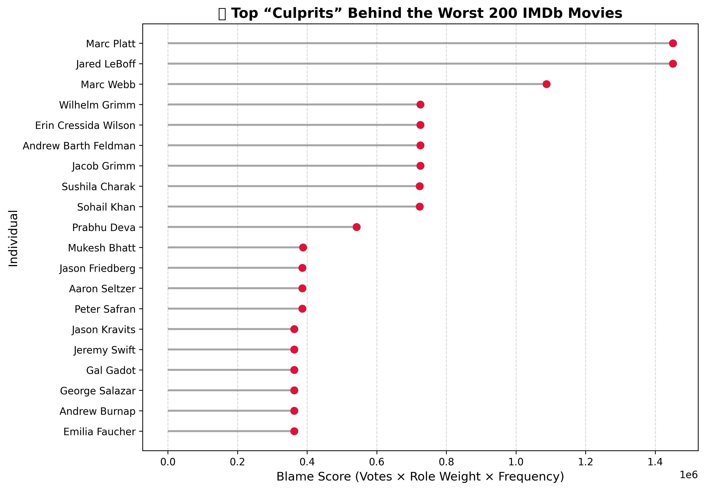

# 🎬 IMDb Lowest-Rated Movies: An Exploratory Data Project

This project explores the worst-rated titles on IMDb using public datasets and uncovers the Top Creative Culprits most commonly involved in these films.

We combine **data filtering**, **SQL analytics**, and **visual storytelling** — including an interactive Colab notebook and blame-weighted visual scoring — to spotlight patterns in bad movies.

---

## 📁 Project Structure

| Folder | Description |
|--------|-------------|
| `data/` | Condensed and filtered IMDb `.csv` files |
| `notebooks/` | Jupyter notebooks (Colab, SQL queries, visualizations) |
| `queries/` | Saved SQL queries used throughout analysis |
| `visuals/` | Exported charts and graphs |

---

## 🧠 Key Features

✅ **Chunked filtering** of massive `.tsv` IMDb datasets  
✅ **SQLite database** setup for efficient querying  
✅ **Role-weighted scoring** to rank frequent "culprits"  
✅ **Lollipop chart** visualization for top offenders  
✅ **Interactive dropdown notebook** powered by `ipywidgets`

---

## 🔍 Highlight: Who's Behind the Worst Movies?

We calculated a **"blame score"** by combining:

- Number of appearances on the bottom 200 list
- Total number of IMDb votes
- Role-based weighting (Producer > Director > Writer > Actor)

📊 See the lollipop chart here:  

---

## ⚙️ Interactive Notebook (Colab)

Explore individual contributors dynamically:

> ℹ️ Note: GitHub does not render widget-enabled notebooks. Use the button above to open the notebook in Colab for full interactivity.

---

## 📂 Data Sources

- IMDb Datasets: [https://datasets.imdbws.com/](https://datasets.imdbws.com/)
- Filtered `.csv` versions available in this project’s `/data` folder  
- Full datasets (merged + raw): [📁 Google Drive Link]([https://drive.google.com/your-shared-folder-here](https://drive.google.com/drive/folders/1cPmar2bYS2sHzuSRAQTB2wdgpFWywEH5?usp=sharing)) 

---

## 🛠 Tools Used

- Python (`pandas`, `sqlite3`, `matplotlib`, `ipywidgets`)
- Google Colab
- SQLite for querying and schema inspection

---

## 🚧 Next Steps

- Add time-based visualizations for worst movies over the decades
- Build a predictor for low-rated content

---

## 🙌 Acknowledgements

Thanks to IMDb for making its data openly available.

---

*Built by [Your Name](https://github.com/Data-Matt0) – feedback and PRs welcome!*
